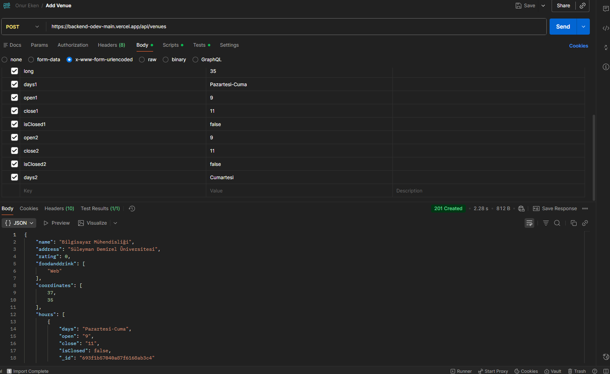
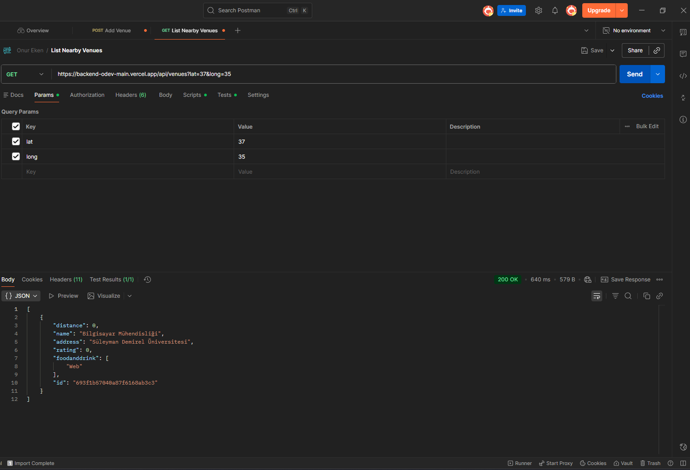
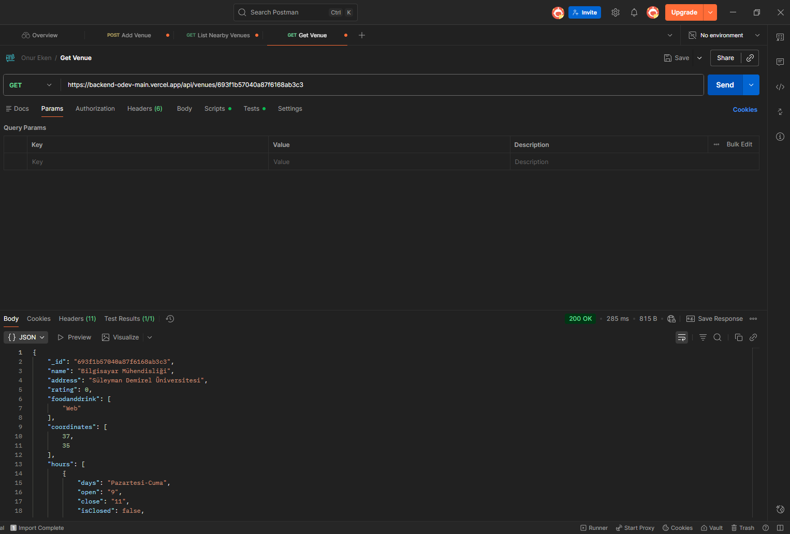
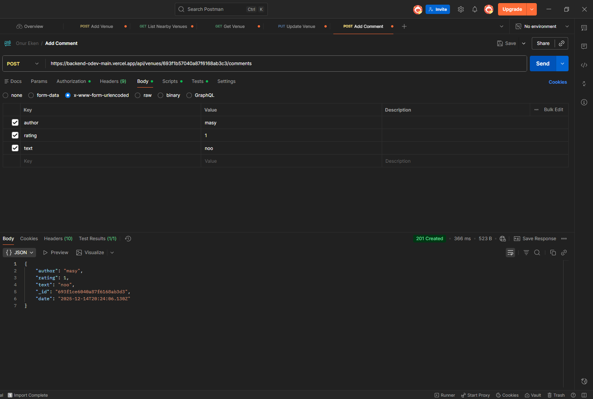
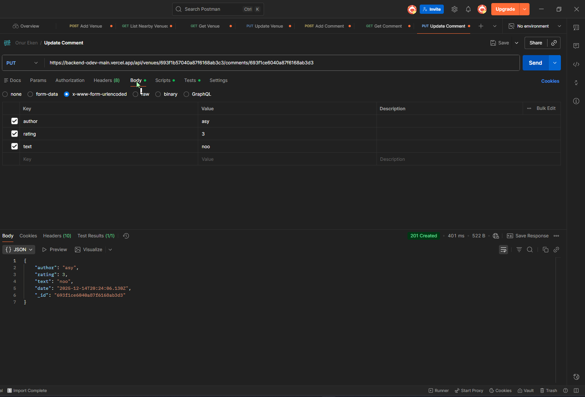
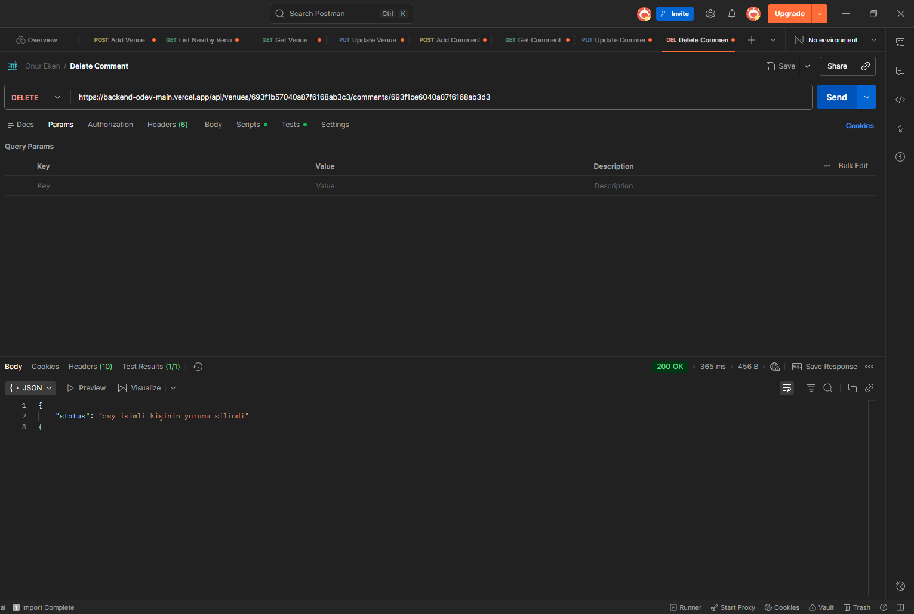

**Demo:** [https://backend-odev-main.vercel.app/](https://backend-odev-main.vercel.app/)

##  Kısa Açıklama
*	API,mekan(venue) verilerini yönetir:listeleme,ekleme,görüntüleme,güncelleme ve silme
*	MongoDB Cloud kullanır.

##  API Endpoints

* **Tüm Mekanları Listele:** `GET /api/venues`
* **Yeni Mekan Ekle:** `POST /api/venues`
* **Mekan Detayını Getir:** `GET /api/venues/:venueid`
* **Mekanı Güncelle:** `PUT /api/venues/:venueid`
* **Mekanı Sil:** `DELETE /api/venues/:venueid`
* **Yorum Ekle:** `POST /api/venues/:venueid/comments`
* **Yorum Getir:** `GET /api/venues/:venueid/comments/:commentid`
* **Yorum Güncelle:** `PUT /api/venues/:venueid/comments/:commentid`
* **Yorum Sil:** `DELETE /api/venues/:venueid/comments/:commentid`

Postman Test Sonucu Aşağıda Postman ile alınmış test sonuçlarının ekran görüntüsü bulunmaktadır.

##  Postman Test Sonuçları

Aşağıda API testlerinin sonuçları yer almaktadır:

### 1. Mekan Ekle (Add Venue)

### 2. Yakındaki Mekanları Listele (List Nearby Venues)

### 3. Mekan Getir (Get Venue)

### 4. Mekan Güncelle (Update Venue)

### 5. Mekan Sil (Delete Venue)

### 6. Yorum Ekle (Add Comment)

### 7. Yorum Getir (Get Comment)

### 8. Yorum Güncelle (Update Comment)

### 9. Yorum Sil (Delete Comment)
